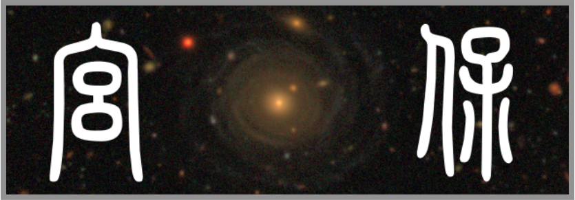

# KungPao (宫保) - Delicious Galaxies!

------

Besides being one of the [signature Chinese dishes](https://en.wikipedia.org/wiki/Kung_Pao_chicken), `kungpao` can also help you deal with photometry of galaxies from recent imaging surveys (e.g. HSC, DECaLS).

Also, `kungpao` does not stand for anything because forced acronym is for psychopath.